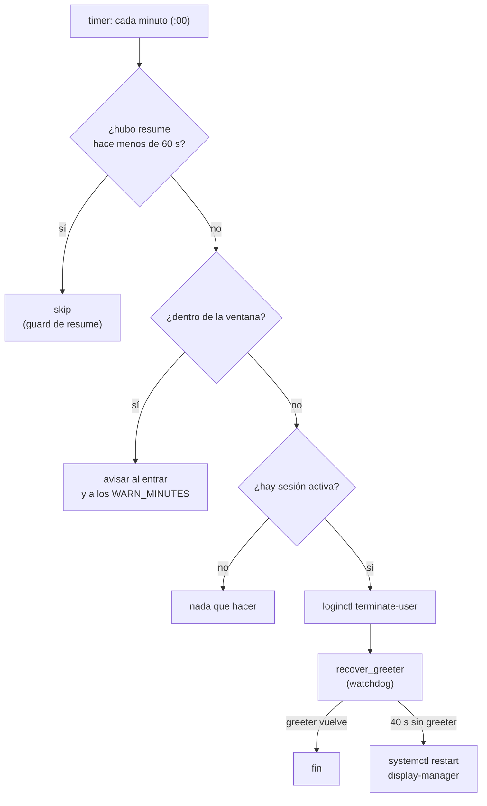

# Flujo de enforcement

Una pasada de `focusguard-enforce` (cada minuto):

El estado (`/run/focusguard`, tmpfs) hace la pasada idempotente:

| Archivo | Para qué |
|---|---|
| `session` | detectar el inicio de sesión (aviso de bienvenida) |
| `window` | saber si ya se entró en esta ventana (limpiar avisos) |
| `warn-<m>` | no repetir el aviso de "faltan m minutos" |
| `killed` | no expulsar en bucle |
| `resumed` | guard de resume |
