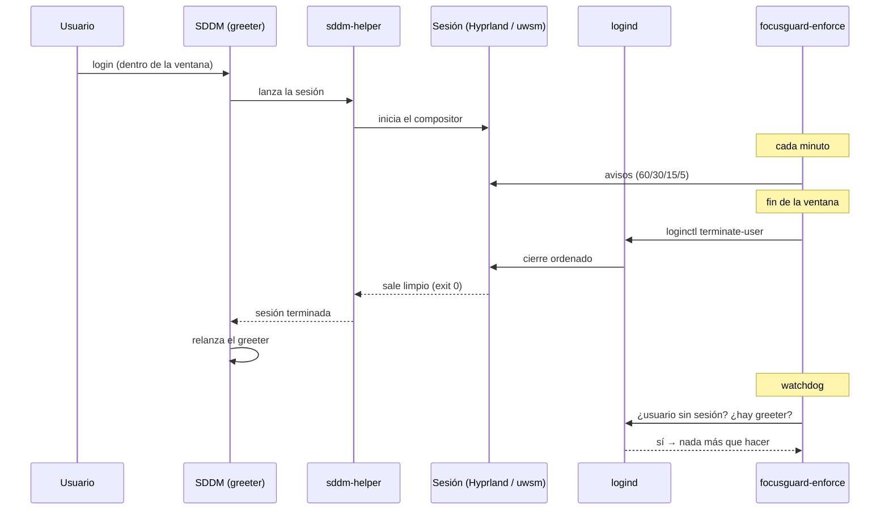
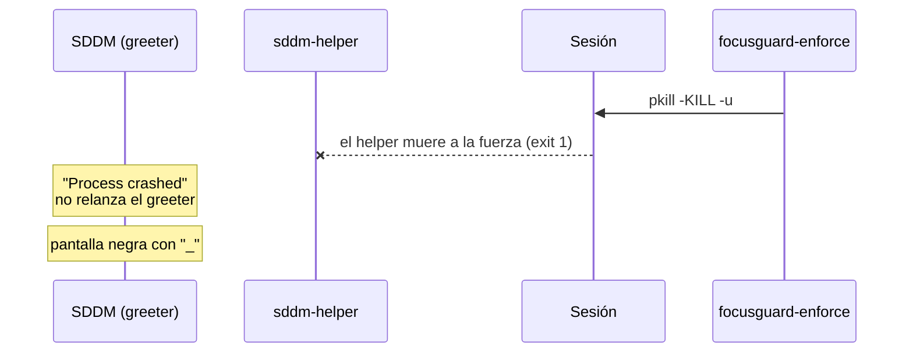

# Ciclo de sesión

Cómo muere una sesión gráfica y por qué el **cómo** importa tanto.

## Forma correcta (lo que hace el repo)

## Forma incorrecta (el bug de la pantalla negra)

## La lección

El display manager no observa "el usuario se fue": observa **cómo salió su helper**. Un
cierre ordenado (0) dispara el relanzado del greeter; un cierre anómalo (1) lo deja colgado.

Por eso el módulo 02:

1. usa `loginctl terminate-user` (ordenado),
2. tiene un **watchdog** por si igual falla, y
3. tiene un **guard de resume** para no hacerlo justo cuando el DRM se reanuda.
